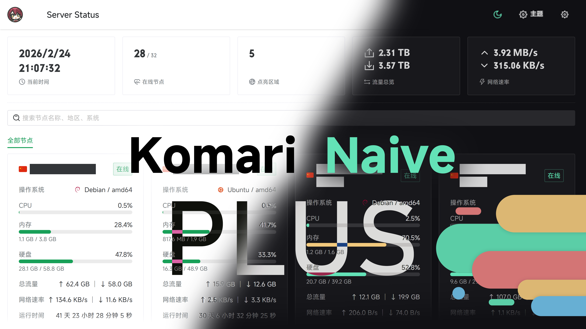

<h3 align="center"> Komari Naive </h3>
<p align="center">基于 Vue 3 + Vite + Naive UI 构建的 Komari Monitor 主题
</p>
<a href="https://github.com/iKeilo/komari-theme-naive-plus">

</a>
<p align="center">使用ChatGPT 4.5编程
</p>
## 使用

1. 从 [Release 页面](https://github.com/iKeilo/komari-theme-naive-plus/releases/download/main/komari-theme-naive-plus-build-b2d4023.zip) 下载最新的 `komari-theme-naive-build-plus-*.zip` 文件
2. 登录 Komari Monitor 后，点击 `设置`，选择 `主题管理` 选项卡
3. 点击 `上传主题` 按钮，选择下载的 `komari-theme-naive-build-*.zip` 文件
4. 刷新页面，即可看到新的主题

## 环境要求

- Node.js: `^20.19.0` 或 `>=22.12.0`
- pnpm: `^10.28.2`

## 开发

```bash
# 安装依赖
pnpm i

# 启动开发服务器
pnpm dev

# 代码检查
pnpm lint
```

## 构建

```bash
# 类型检查 + 生产构建
pnpm build

# 预览生产构建
pnpm preview
```

## 技术栈

| 类别      | 技术                                       |
| --------- | ------------------------------------------ |
| 框架      | Vue 3 (Composition API + `<script setup>`) |
| 构建工具  | Vite 7                                     |
| UI 组件库 | Naive UI                                   |
| 状态管理  | Pinia 3                                    |
| 路由      | Vue Router 5                               |
| CSS 方案  | UnoCSS (Wind4 preset) + SCSS               |
| 图表库    | ECharts + vue-echarts                      |
| 代码规范  | ESLint (@antfu/eslint-config) + oxlint     |

## 参考

- [Komari](https://github.com/komari-monitor/komari)
- [Komari Next](https://github.com/tonyliuzj/komari-next)
- [Vue 3](https://vuejs.org/)
- [Vite](https://vitejs.dev/)
- [Naive UI](https://www.naiveui.com/)
- [UnoCSS](https://unocss.dev/)
- [komari-theme-naive]([https://unocss.dev/](https://github.com/lyimoexiao/komari-theme-naive))

## License

[MIT](./LICENSE)
